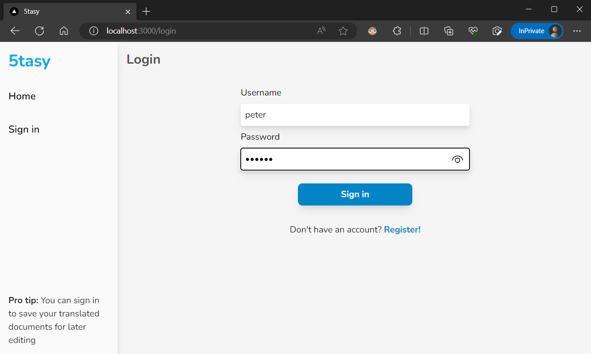
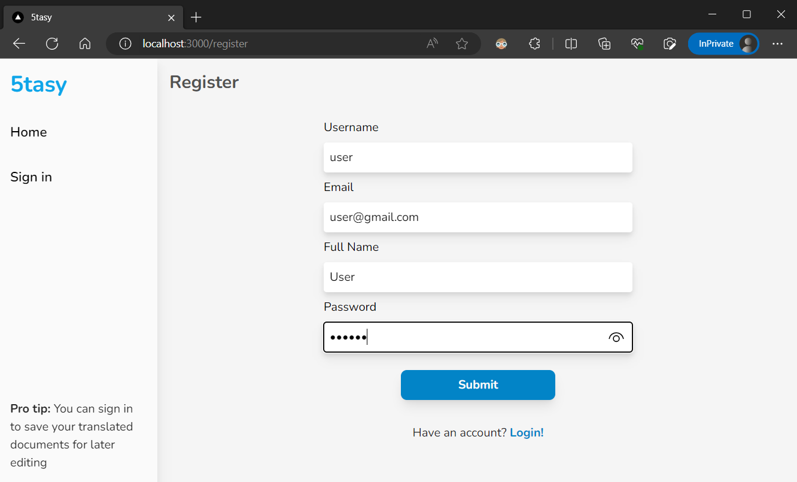
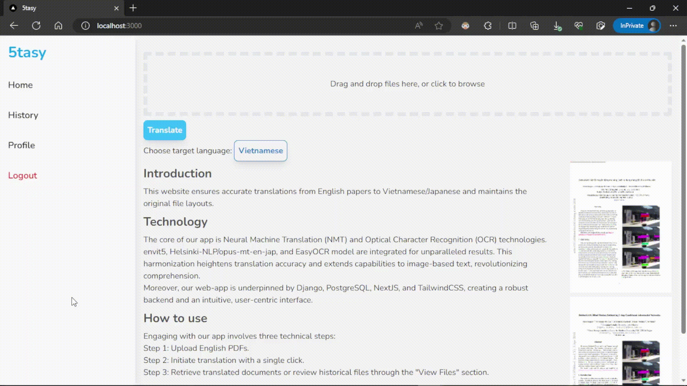
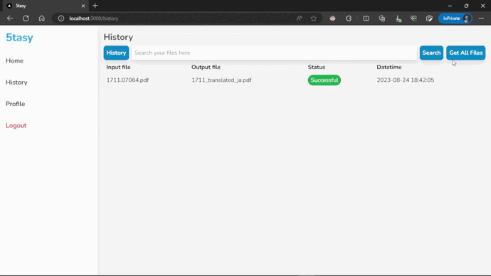

<p align="center">
  <h1 align="center"> 5tasy</h1>
  <h4 align="center" style="font-weight: bold; font-style: italic">A web app for Paper Translation with Layout Recovery!</h4>
</p>

### Contributors

|            Name               | Profile 
|----------------|-------------------------------
|Nguyễn Bảo Tín | [@nbtin](https://github.com/nbtin)            
|Phạm Khánh Trình | [@phkhanhtrinh23](https://github.com/phkhanhtrinh23)           
|Yang Tuấn Anh | [@YangTuanAnh](https://github.com/YangTuanAnh)
|Nguyễn Hoàng Ngọc Hà | [@ngochafromdn](https://github.com/ngochafromdn)
|Nguyễn Minh Lý | [@lynguyenminh](https://github.com/lynguyenminh)

## 1. Table of Contents
- [1. Table of Contents](#1-table-of-contents)
- [2. About The Project](#2-about-the-project)
- [3. Technical Overview](#3-technical-overview)
- [4. Repo Structure](#4-repo-structure)
- [5. How to Install](#5-how-to-install)
- [6. Usage](#6-usage)
- [7 References](#7-references)

## 2. About The Project

Translation with Layout Recovery is a cutting-edge approach in the field of natural language processing that goes beyond traditional machine translation methods. While conventional translation models focus solely on converting text from one language to another, **5tasy** takes into account the visual layout and formatting of the text. This approach aims to preserve not only the linguistic content but also the spatial arrangement, font styles, and other visual elements present in the source text.

## 3. Technical Overview

- [**Frontend:**](Frontend/README.md) NextJS, TailwindCSS, NodeJS, Yarn.
- [**Backend:**](Backend/README.md) Django REST Framework.
- **Database:** PostgreSQL.
- **Storage:** Firebase Cloud Storage.
- **Deployment:** Docker (Docker-compose).
- **AI Core:**
   - **NMT:** envit5-translation.
   - **Layout Recovery:** MaskRCNN.
   - **OCR:** EasyOCR.
## 4. Repo Structure
```
.
├── Backend
│   ├── account
│   ├── services
│   └── translation
├── Frontend
│   ├── app
│   │   ├── api
│   │   ├── components
│   │   ├── history
│   │   │   └── api
│   │   ├── login
│   │   │   └── api
│   │   ├── profile
│   │   │   └── api
│   │   └── register
│   │       └── api
│   └── public
└── Model
    └── utils
    └── main.py
```

## 5. How to Install
To install and run the **5tasy** web app, please follow the steps below:

1. Ensure that Docker is installed on your system. You can download and install Docker from the official website: [Docker Engine for Ubuntu](https://docs.docker.com/engine/install/ubuntu/) or [Docker Desktop](https://www.docker.com/products/docker-desktop/).

2. Clone this repository to your local machine using the following command:

   ```shell
   git clone https://github.com/phkhanhtrinh23/translation_layoutrecovery.git
   ```

3. Navigate to the project directory:

   ```shell
   cd translation_layoutrecovery
   ```

4. Build the Docker image and run the container using the following command:

   ```shell
   docker compose up --build
   ```

5. Wait for the installation process to complete. Once the downloading is done, the web app will be ready to use.

6. To stop the web app, press `Ctrl + C` in the terminal and run the following command:

   ```shell
   docker compose down
   ```

## 6. Usage
To use the web app, follow the steps below:

1. Open your web browser and navigate to [http://localhost:3000](http://localhost:3000).

2. You first need to register the account and sign in to use the web functions.
   <div class="row">
      <div class="column">
         
         
      </div>
   </div>

3. In the web app, you can browse and upload an English PDF file using the provided interface.

4. Click to choose the target language and Hit the **Translate** button to start the translation process.
   

5. The model will then process your file and return the translated PDF file with the same layout as the original one. Hit the `Translated` linklabel or open the `History` bar to view the result. Here you can open to view and download your files.
   

6. You can also search for your files in the `History` bar by entering the keywords in the search box.
   

## 7. References
- **MaskRCNN** - phamquiluan - [PubLayNet](https://github.com/phamquiluan/PubLayNet)
- **EasyOCR** - JadedAI - [jaded.ai](https://www.jaided.ai/easyocr/)
- **envit5-translation** - Chinh Ngo, Trieu H. Trinh, Long Phan, Hieu Tran, Tai Dang, Hieu Nguyen, Minh Nguyen, Minh-Thang Luong - [huggingface.co](https://huggingface.co/VietAI/envit5-translation).
- **opus-mt-en-jap** - Helsinki-NLP - [huggingface.co](https://huggingface.co/Helsinki-NLP/opus-mt-en-jap).
- **AutoPrompt** - Taylor Shin, Yasaman Razeghi, Robert L. Logan IV, Eric Wallace, Sameer Singh - [arxiv.org](https://arxiv.org/pdf/2010.15980.pdf)
- **Guides on using Docker for Python application** - [Docker docs](https://docs.docker.com/language/python/).
- **Install Docker Engine on Ubuntu** - [Docker docs](https://docs.docker.com/engine/install/ubuntu/).

## Contribution

Contributions are what make GitHub such an amazing place to be learn, inspire, and create. Any contributions you make are greatly appreciated.

1. Fork the project
2. Create your Contribute branch: `git checkout -b contribute/Contribute`
3. Commit your changes: `git commit -m 'add your messages'`
4. Push to the branch: `git push origin contribute/Contribute`
5. Open a pull request
